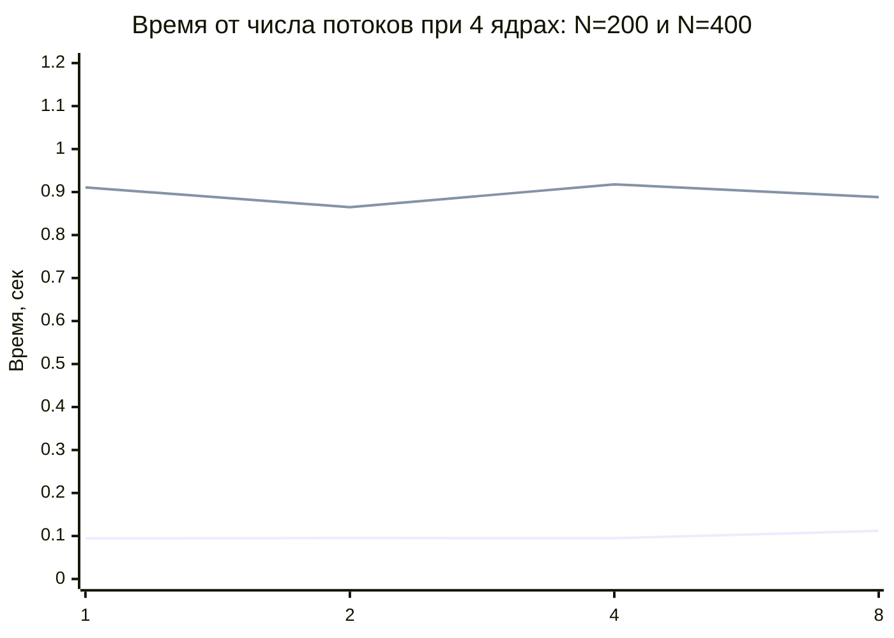
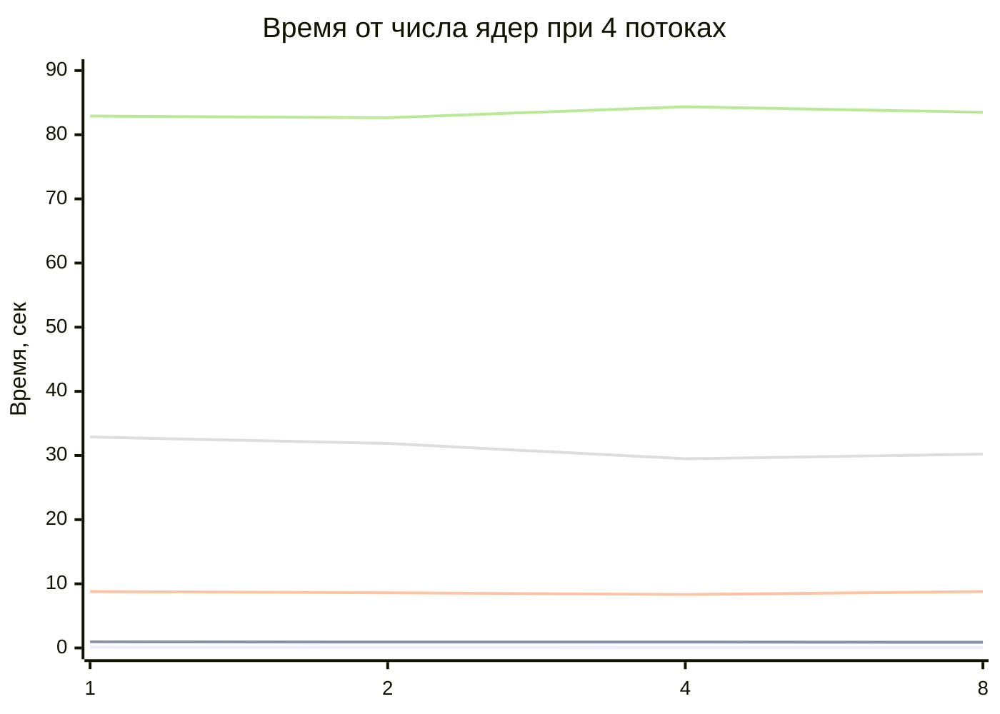
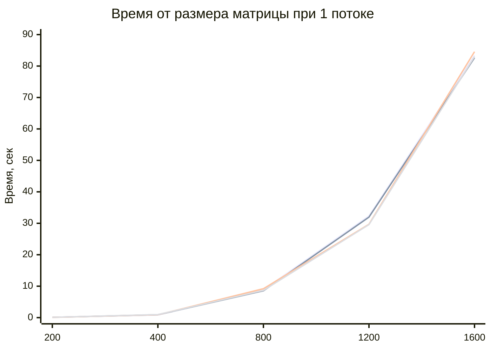

# Parallelnoe_Programming
Markdown

# Отчёт по лабораторной работе  
## Параллельное умножение матриц с использованием OpenMP

## Описание работы

В рамках работы была модифицирована программа умножения квадратных матриц для параллельного выполнения с использованием технологии **OpenMP**.  

Проведена серия экспериментов с изменением:

- количества потоков: **1, 2, 4, 8**
- количества ядер: **1, 2, 4, 8**
- размеров матриц: **200, 400, 800, 1200, 1600**

Для каждого запуска измерялось время выполнения операции умножения матриц.

---

## Экспериментальные данные

| Размер | Потоки | Ядра | Операций(N^3) | Время(сек) |
|-------:|-------:|-----:|--------------:|-----------:|
| 200 | 1 | 1 | 8000000 | 0.103000 |
| 200 | 2 | 1 | 8000000 | 0.123959 |
| 200 | 4 | 1 | 8000000 | 0.111392 |
| 200 | 8 | 1 | 8000000 | 0.102587 |
| 200 | 1 | 2 | 8000000 | 0.095172 |
| 200 | 2 | 2 | 8000000 | 0.097589 |
| 200 | 4 | 2 | 8000000 | 0.096598 |
| 200 | 8 | 2 | 8000000 | 0.096600 |
| 200 | 1 | 4 | 8000000 | 0.094520 |
| 200 | 2 | 4 | 8000000 | 0.095234 |
| 200 | 4 | 4 | 8000000 | 0.094870 |
| 200 | 8 | 4 | 8000000 | 0.111946 |
| 200 | 1 | 8 | 8000000 | 0.095209 |
| 200 | 2 | 8 | 8000000 | 0.131781 |
| 200 | 4 | 8 | 8000000 | 0.094913 |
| 200 | 8 | 8 | 8000000 | 0.094868 |
| 400 | 1 | 1 | 64000000 | 0.845499 |
| 400 | 2 | 1 | 64000000 | 0.871461 |
| 400 | 4 | 1 | 64000000 | 0.960615 |
| 400 | 8 | 1 | 64000000 | 0.934980 |
| 400 | 1 | 2 | 64000000 | 0.910272 |
| 400 | 2 | 2 | 64000000 | 0.896518 |
| 400 | 4 | 2 | 64000000 | 0.910290 |
| 400 | 8 | 2 | 64000000 | 0.914630 |
| 400 | 1 | 4 | 64000000 | 0.910782 |
| 400 | 2 | 4 | 64000000 | 0.864745 |
| 400 | 4 | 4 | 64000000 | 0.917968 |
| 400 | 8 | 4 | 64000000 | 0.888135 |
| 400 | 1 | 8 | 64000000 | 0.969096 |
| 400 | 2 | 8 | 64000000 | 0.868752 |
| 400 | 4 | 8 | 64000000 | 0.894495 |
| 400 | 8 | 8 | 64000000 | 0.930169 |
| 800 | 1 | 1 | 512000000 | 8.860415 |
| 800 | 2 | 1 | 512000000 | 8.894811 |
| 800 | 4 | 1 | 512000000 | 8.800895 |
| 800 | 8 | 1 | 512000000 | 8.809828 |
| 800 | 1 | 2 | 512000000 | 8.528934 |
| 800 | 2 | 2 | 512000000 | 8.712039 |
| 800 | 4 | 2 | 512000000 | 8.608311 |
| 800 | 8 | 2 | 512000000 | 8.631391 |
| 800 | 1 | 4 | 512000000 | 9.195230 |
| 800 | 2 | 4 | 512000000 | 8.369589 |
| 800 | 4 | 4 | 512000000 | 8.333178 |
| 800 | 8 | 4 | 512000000 | 8.249720 |
| 800 | 1 | 8 | 512000000 | 8.669487 |
| 800 | 2 | 8 | 512000000 | 8.596054 |
| 800 | 4 | 8 | 512000000 | 8.785929 |
| 800 | 8 | 8 | 512000000 | 8.780785 |
| 1200 | 1 | 1 | 1728000000 | 32.355995 |
| 1200 | 2 | 1 | 1728000000 | 33.246753 |
| 1200 | 4 | 1 | 1728000000 | 32.891140 |
| 1200 | 8 | 1 | 1728000000 | 32.619233 |
| 1200 | 1 | 2 | 1728000000 | 31.956459 |
| 1200 | 2 | 2 | 1728000000 | 31.907176 |
| 1200 | 4 | 2 | 1728000000 | 31.880586 |
| 1200 | 8 | 2 | 1728000000 | 31.184913 |
| 1200 | 1 | 4 | 1728000000 | 29.702240 |
| 1200 | 2 | 4 | 1728000000 | 29.637477 |
| 1200 | 4 | 4 | 1728000000 | 29.484893 |
| 1200 | 8 | 4 | 1728000000 | 29.665737 |
| 1200 | 1 | 8 | 1728000000 | 29.581620 |
| 1200 | 2 | 8 | 1728000000 | 29.492143 |
| 1200 | 4 | 8 | 1728000000 | 30.217337 |
| 1200 | 8 | 8 | 1728000000 | 30.892852 |
| 1600 | 1 | 1 | 4096000000 | 83.371233 |
| 1600 | 2 | 1 | 4096000000 | 82.798981 |
| 1600 | 4 | 1 | 4096000000 | 82.910802 |
| 1600 | 8 | 1 | 4096000000 | 82.935764 |
| 1600 | 1 | 2 | 4096000000 | 82.609997 |
| 1600 | 2 | 2 | 4096000000 | 82.649957 |
| 1600 | 4 | 2 | 4096000000 | 245.469166 |
| 1600 | 8 | 2 | 4096000000 | 86.233172 |
| 1600 | 1 | 4 | 4096000000 | 84.563345 |
| 1600 | 2 | 4 | 4096000000 | 84.517478 |
| 1600 | 4 | 4 | 4096000000 | 84.365628 |
| 1600 | 8 | 4 | 4096000000 | 84.197494 |
| 1600 | 1 | 8 | 4096000000 | 83.004848 |
| 1600 | 2 | 8 | 4096000000 | 83.307280 |
| 1600 | 4 | 8 | 4096000000 | 83.517251 |
| 1600 | 8 | 8 | 4096000000 | 83.086719 |

---

## График 1. Зависимость времени от числа потоков

Для наглядности построим график для случая **4 ядра**.

## Анализ графика
Для маленьких матриц (200, 400) изменение числа потоков почти не влияет на время.
Для 800 и 1200 наблюдается небольшое улучшение при увеличении числа потоков.
Для 1600 ускорение почти отсутствует.
В ряде случаев увеличение числа потоков даже ухудшает время выполнения из-за накладных расходов на управление потоками.

## График 2. Зависимость времени от числа ядер
Для построения этого графика возьмём результаты при 4 потоках.

## Анализ графика
При увеличении числа ядер заметного линейного ускорения не наблюдается.
Для 1200 заметен лучший результат на 4 ядрах.
Для 1600 при 2 ядрах и 4 потоках наблюдается сильный выброс (245.469166 сек), который можно считать аномалией.
В целом рост числа ядер даёт слабый эффект, особенно на малых размерах матриц.

## График 3. Зависимость времени от размера матрицы
Для сравнения возьмём по одному эксперименту для разных ядер, когда число потоков равно 1.

## Анализ графика
Время выполнения быстро растёт с увеличением размера матрицы.
Рост близок к кубической зависимости O(N^3), что соответствует теоретической сложности умножения матриц.
Именно размер матрицы оказывает наибольшее влияние на время выполнения.
Различия между количеством ядер заметно меньше, чем влияние размера задачи.
Общий анализ результатов
По результатам экспериментов можно сделать несколько важных наблюдений:
1. Размер матрицы влияет на время намного сильнее, чем число потоков или ядер.
2. Для небольших матриц параллелизация почти бесполезна, так как накладные расходы на запуск потоков могут перекрывать выигрыш.
3. Для средних и больших матриц ускорение появляется, но остаётся небольшим.
4. Линейного ускорения не достигнуто, то есть увеличение числа потоков в 2 раза не приводит к уменьшению времени в 2 раза.

## Основные причины того, что ускорение оказалось небольшим:
1. Накладные расходы OpenMP
Создание, синхронизация и планирование потоков требуют времени.

2. Ограничение пропускной способности памяти
При умножении больших матриц потоки активно обращаются к общей памяти, что создаёт узкое место.

3. Неидеальная локальность данных
Использование vector<vector<double>> менее эффективно по памяти, чем одномерный массив.

4. Особенности алгоритма
Хотя вычисления распараллелены, доступ к элементам матрицы B[k][j] может работать не слишком эффективно с точки зрения кэш-памяти.

5. Переподписка потоков
Если потоков больше, чем реально доступных вычислительных ресурсов, возможен дополнительный overhead.

## Выводы по работе
В ходе работы программа умножения матриц была успешно модифицирована для параллельного выполнения с помощью OpenMP. Проведённые эксперименты показали следующее:

1. Параллелизация программы реализована корректно и работает на разных размерах матриц.
2. Наибольшее влияние на время выполнения оказывает размер матрицы.
3. Увеличение числа потоков и ядер не всегда приводит к заметному ускорению.
4. Для небольших матриц параллельное выполнение малоэффективно.
5. Для больших матриц наблюдается некоторое снижение времени выполнения, но оно далеко от линейного.
6. Эффективность параллельных вычислений ограничивается накладными расходами, памятью и особенностями хранения данных.

## Итог
Работа показала, что применение OpenMP действительно позволяет распараллелить вычисления, однако реальный выигрыш зависит не только от числа потоков и ядер, но и от структуры алгоритма, особенностей памяти и размера задачи.