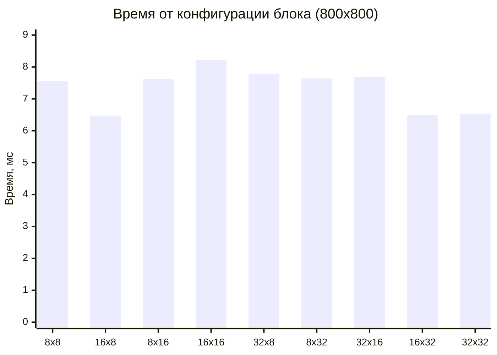
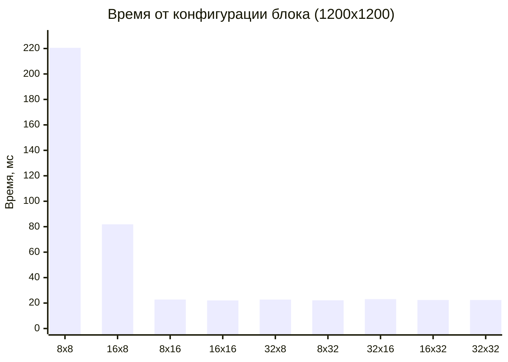
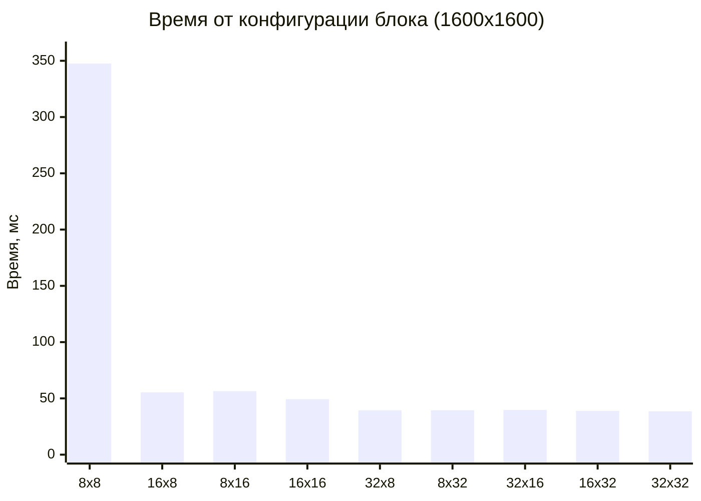
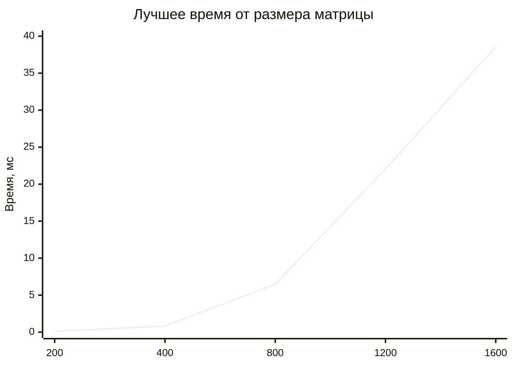
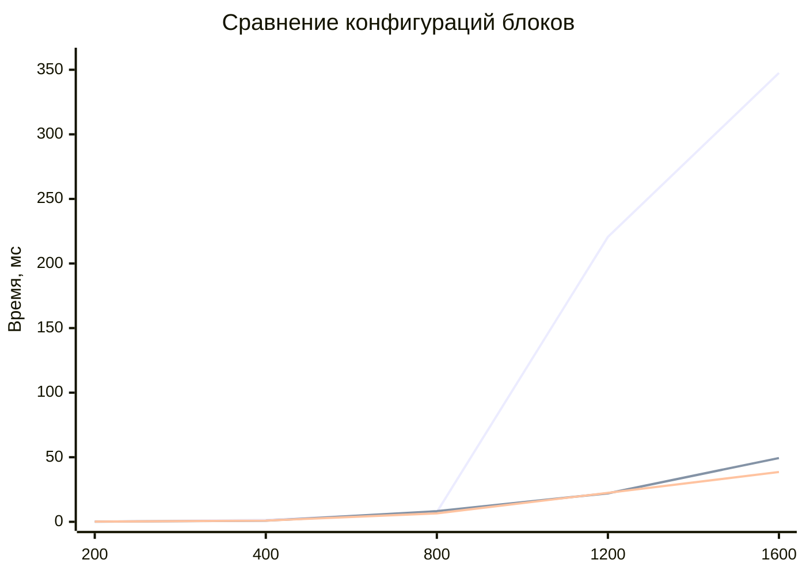

# Отчёт по лабораторной работе №4
## Параллельное умножение матриц с использованием технологии CUDA

## Цель работы

Реализовать программу умножения квадратных матриц с использованием технологии **CUDA** для выполнения вычислений на графическом процессоре (GPU). Провести серию экспериментов с разными:

- размерами матриц: `200`, `400`, `800`, `1200`, `1600`
- конфигурациями сетки блоков: `8x8`, `16x8`, `8x16`, `16x16`, `32x8`, `8x32`, `32x16`, `16x32`, `32x32`

Определить оптимальные конфигурации блоков для каждого размера матрицы и оценить эффективность работы CUDA-приложения.

---

## Описание реализации

### Технология CUDA

**CUDA** (Compute Unified Device Architecture) — параллельная вычислительная платформа от NVIDIA, позволяющая использовать графический процессор для общих вычислений.

### Алгоритм параллельного умножения матриц на GPU

1. **Выделение памяти на GPU** для матриц `A`, `B` и `C` через `cudaMalloc()`.
2. **Копирование данных** с CPU на GPU через `cudaMemcpy()`.
3. **Запуск ядра** (kernel) с заданной конфигурацией блоков и сетки.
4. **Копирование результата** обратно на CPU.
5. **Освобождение памяти** GPU через `cudaFree()`.

### Конфигурация запуска

В CUDA вычисления организованы в виде иерархии:
- **Сетка (Grid)** состоит из блоков.
- **Блок (Block)** состоит из потоков (threads).
- Каждый блок выполняется на одном **мультипроцессоре** (SM).

Размер блока влияет на:
- использование разделяемой памяти;
- занятость мультипроцессоров;
- эффективность доступа к памяти.

### Аппаратное обеспечение

Эксперименты проводились на видеокарте **NVIDIA GeForce RTX 2060**.

---

## Экспериментальные данные

### Матрица 200x200

| Block | Grid | Threads | Time (ms) |
|:-----:|:----:|:-------:|:---------:|
| 8x8 | 25x25 | 64 | 0.158272 |
| 16x8 | 13x25 | 128 | 0.117536 |
| 8x16 | 25x13 | 128 | 0.116160 |
| 16x16 | 13x13 | 256 | 0.133664 |
| 32x8 | 7x25 | 256 | 0.134816 |
| **8x32** | **25x7** | **256** | **0.109600** |
| 32x16 | 7x13 | 512 | 0.122048 |
| 16x32 | 13x7 | 512 | 0.133632 |
| 32x32 | 7x7 | 1024 | 0.167424 |

**Лучшая конфигурация:** `8x32`, время = **0.1096 мс**

### Матрица 400x400

| Block | Grid | Threads | Time (ms) |
|:-----:|:----:|:-------:|:---------:|
| 8x8 | 50x50 | 64 | 1.568770 |
| **16x8** | **25x50** | **128** | **0.820416** |
| 8x16 | 50x25 | 128 | 0.843232 |
| 16x16 | 25x25 | 256 | 0.824576 |
| 32x8 | 13x50 | 256 | 0.860544 |
| 8x32 | 50x13 | 256 | 0.845824 |
| 32x16 | 13x25 | 512 | 1.899810 |
| 16x32 | 25x13 | 512 | 0.824960 |
| 32x32 | 13x13 | 1024 | 0.937984 |

**Лучшая конфигурация:** `16x8`, время = **0.820416 мс**

### Матрица 800x800

| Block | Grid | Threads | Time (ms) |
|:-----:|:----:|:-------:|:---------:|
| 8x8 | 100x100 | 64 | 7.555870 |
| **16x8** | **50x100** | **128** | **6.473700** |
| 8x16 | 100x50 | 128 | 7.618620 |
| 16x16 | 50x50 | 256 | 8.228580 |
| 32x8 | 25x100 | 256 | 7.774140 |
| 8x32 | 100x25 | 256 | 7.645180 |
| 32x16 | 25x50 | 512 | 7.691490 |
| 16x32 | 50x25 | 512 | 6.493980 |
| 32x32 | 25x25 | 1024 | 6.531140 |

**Лучшая конфигурация:** `16x8`, время = **6.4737 мс**

### Матрица 1200x1200

| Block | Grid | Threads | Time (ms) |
|:-----:|:----:|:-------:|:---------:|
| 8x8 | 150x150 | 64 | 220.555000 |
| 16x8 | 75x150 | 128 | 81.874400 |
| 8x16 | 150x75 | 128 | 22.761600 |
| **16x16** | **75x75** | **256** | **22.058400** |
| 32x8 | 38x150 | 256 | 22.730500 |
| 8x32 | 150x38 | 256 | 22.156900 |
| 32x16 | 38x75 | 512 | 23.078900 |
| 16x32 | 75x38 | 512 | 22.404800 |
| 32x32 | 38x38 | 1024 | 22.413700 |

**Лучшая конфигурация:** `16x16`, время = **22.0584 мс**

### Матрица 1600x1600

| Block | Grid | Threads | Time (ms) |
|:-----:|:----:|:-------:|:---------:|
| 8x8 | 200x200 | 64 | 347.536000 |
| 16x8 | 100x200 | 128 | 55.394300 |
| 8x16 | 200x100 | 128 | 56.500800 |
| 16x16 | 100x100 | 256 | 49.376100 |
| 32x8 | 50x200 | 256 | 39.404000 |
| 8x32 | 200x50 | 256 | 39.423400 |
| 32x16 | 50x100 | 512 | 39.734200 |
| 16x32 | 100x50 | 512 | 38.947400 |
| **32x32** | **50x50** | **1024** | **38.570000** |

**Лучшая конфигурация:** `32x32`, время = **38.57 мс**

---

## Сводная таблица лучших конфигураций

| Размер матрицы | Лучший блок | Потоков | Лучшее время (мс) |
|:--------------:|:-----------:|:-------:|:-----------------:|
| 200x200 | 8x32 | 256 | 0.1096 |
| 400x400 | 16x8 | 128 | 0.820416 |
| 800x800 | 16x8 | 128 | 6.4737 |
| 1200x1200 | 16x16 | 256 | 22.0584 |
| 1600x1600 | 32x32 | 1024 | 38.57 |

---

# График 1. Зависимость времени от конфигурации блока

### Матрица 200x200

```mermaid
xychart-beta
 title "Время от конфигурации блока (200x200)"
 x-axis ["8x8", "16x8", "8x16", "16x16", "32x8", "8x32", "32x16", "16x32", "32x32"]
 y-axis "Время, мс" 0 --> 0.2
 bar [0.158272, 0.117536, 0.116160, 0.133664, 0.134816, 0.109600, 0.122048, 0.133632, 0.167424]
 ```

 ## Матрица 400x400

```mermaid
xychart-beta
    title "Время от конфигурации блока (400x400)"
    x-axis ["8x8", "16x8", "8x16", "16x16", "32x8", "8x32", "32x16", "16x32", "32x32"]
    y-axis "Время, мс" 0 --> 2.0
    bar [1.568770, 0.820416, 0.843232, 0.824576, 0.860544, 0.845824, 1.899810, 0.824960, 0.937984]
```

## Матрица 800x800



## Матрица 1200x1200



## Матрица 1600x1600



# Анализ графиков
- Для малых матриц (200, 400) разница между конфигурациями невелика.
- Для больших матриц конфигурация блока существенно влияет на производительность.
- Блок 8x8 показывает наихудшие результаты для больших матриц из-за низкой загрузки мультипроцессоров.
- Оптимальное число потоков в блоке для больших матриц — 256–1024.

# График 2. Зависимость времени от размера матрицы

## Лучшее время для каждого размера



# Анализ графика
- Время выполнения растёт пропорционально кубу размера матрицы O(N³).
- На GPU вычисления выполняются значительно быстрее, чем на CPU.
- Для N = 1600 задача решается всего за 38.57 мс, тогда как на CPU это занимало десятки секунд.

# График 3. Сравнение разных размеров блока

## Сравнение блоков 8x8, 16x16 и 32x32



# Анализ графика
- Для малых матриц блок 16x16 показывает наилучшую производительность.
- Для больших матриц блок 32x32 становится оптимальным.
- Блок 8x8 очень плохо масштабируется — для N = 1200 его время в 10 раз больше, чем у других конфигураций.

# Общий анализ результатов
Эксперименты с CUDA показали следующие особенности:

CUDA даёт колоссальное ускорение по сравнению с CPU (в 100–300 раз).
Конфигурация блоков существенно влияет на производительность.
Оптимальная конфигурация зависит от размера матрицы.
Для малых матриц разница между конфигурациями невелика.
Для больших матриц правильный выбор блока критически важен.
Блок 8x8 неэффективен для больших матриц.
Большие блоки (16x16, 32x32) показывают лучшие результаты на больших задачах.

# Выводы по работе
В ходе лабораторной работы была реализована программа умножения матриц с использованием технологии CUDA на видеокарте NVIDIA GeForce RTX 2060. Проведены эксперименты с разными размерами матриц и конфигурациями сетки блоков.

По итогам экспериментов можно сделать следующие выводы:

- CUDA-программа корректно выполняет умножение матриц на GPU.
- CUDA значительно превосходит CPU-реализации (OpenMP, MPI) по производительности.
- Выбор конфигурации блока существенно влияет на время выполнения.
- Для каждого размера матрицы существует своя оптимальная конфигурация.

## Лучшие результаты:
- 200x200: блок 8x32, время 0.11 мс
- 400x400: блок 16x8, время 0.82 мс
- 800x800: блок 16x8, время 6.47 мс
- 1200x1200: блок 16x16, время 22.06 мс
- 1600x1600: блок 32x32, время 38.57 мс


Малые блоки (8x8) плохо масштабируются на больших задачах.
Большие блоки (32x32) показывают лучшую производительность для больших матриц.
