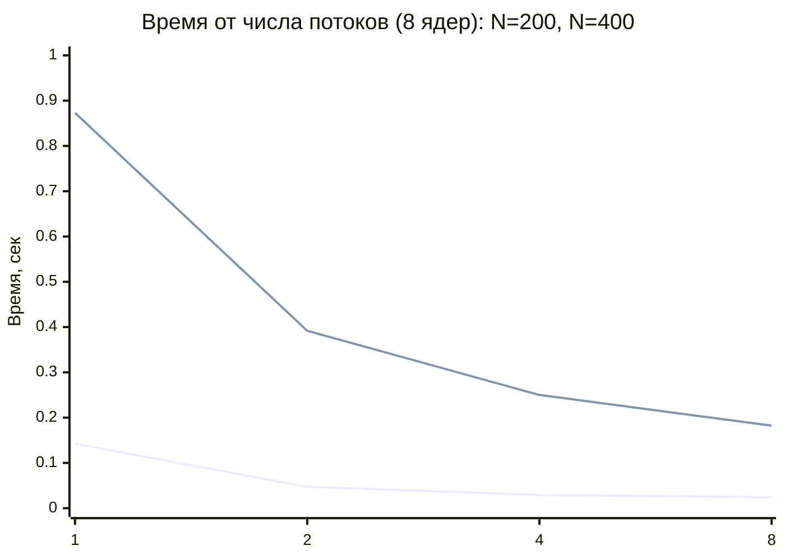
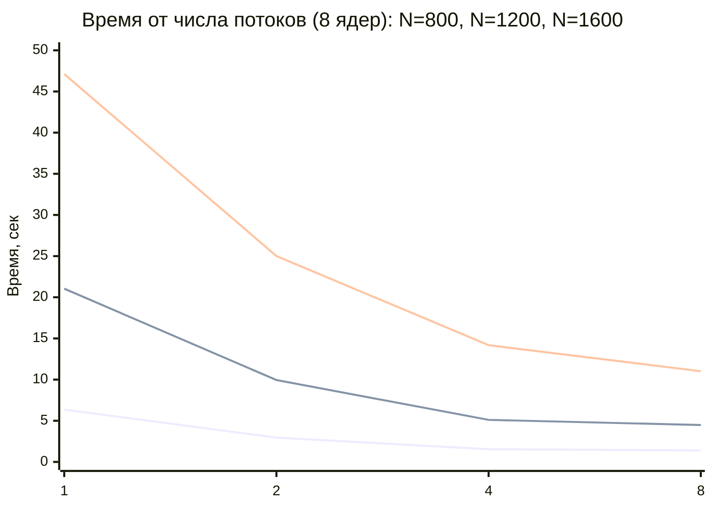
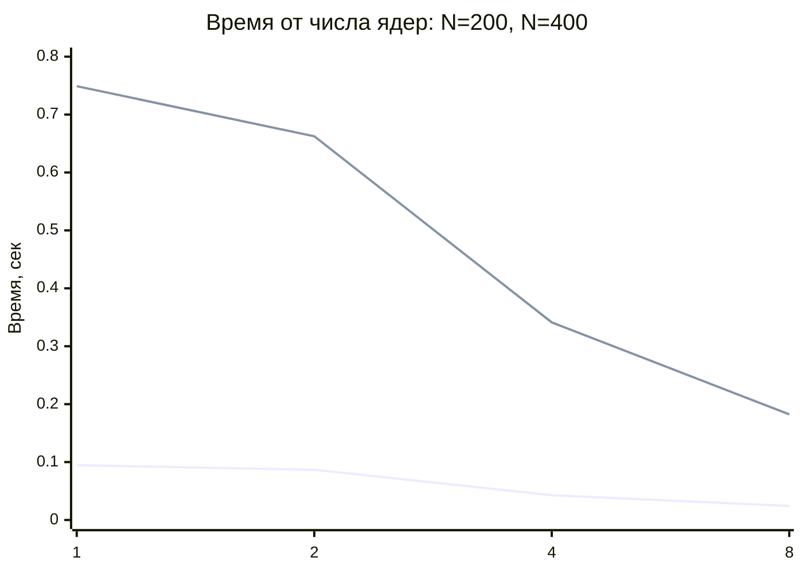
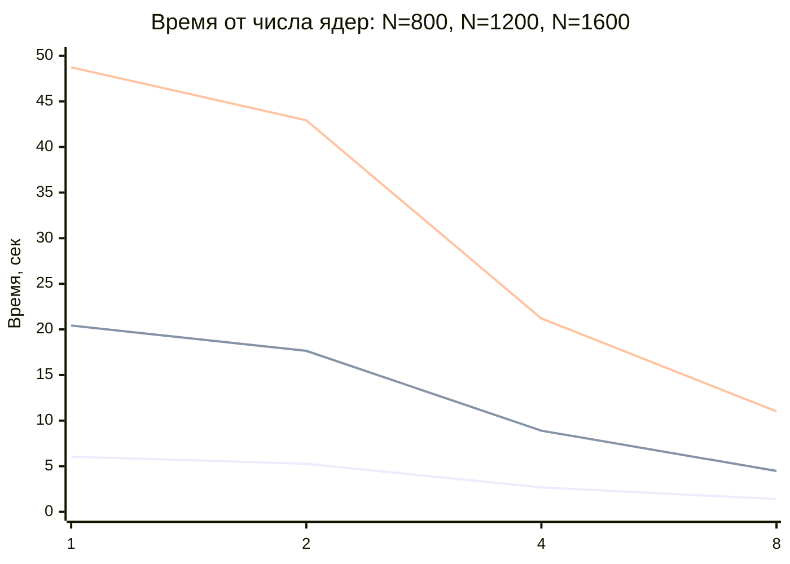
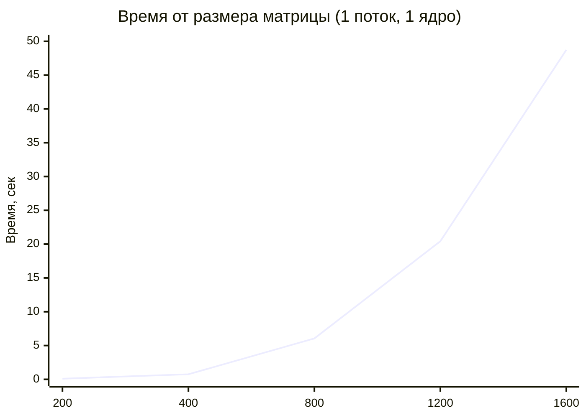
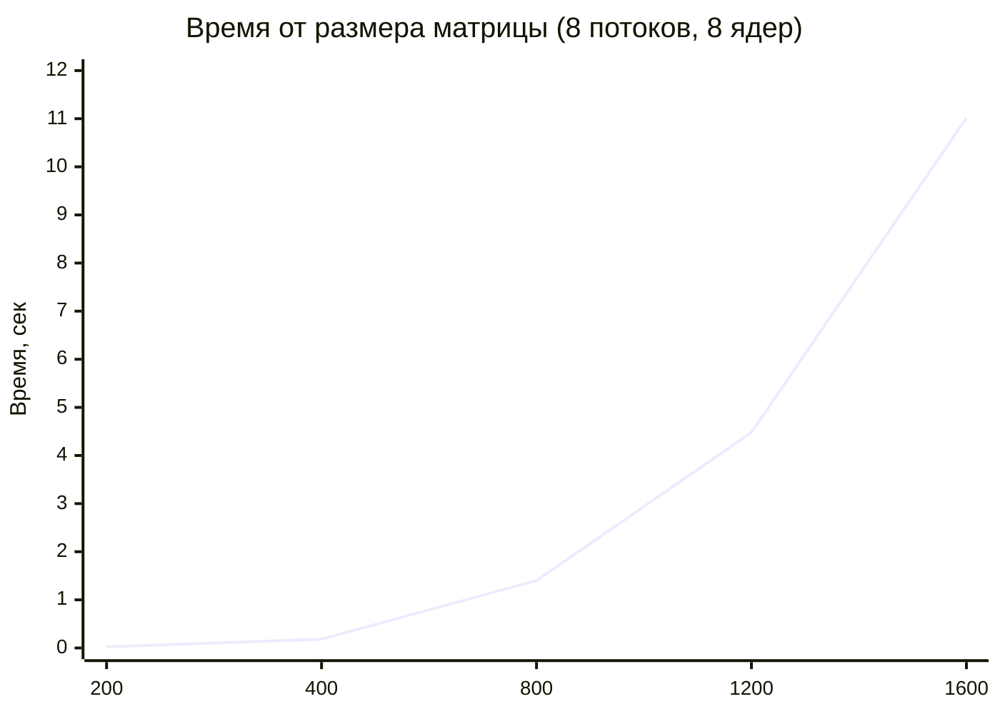
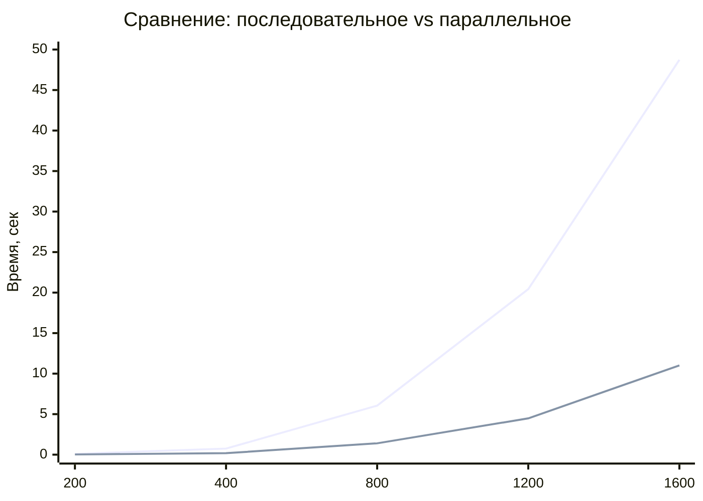
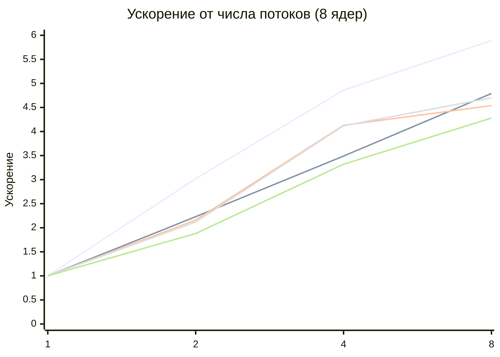

# Parallelnoe_Programming
# Отчёт по лабораторной работе
## Параллельное умножение матриц с использованием OpenMP

## Цель работы

Модифицировать программу умножения квадратных матриц для параллельного выполнения с использованием технологии **OpenMP** и провести серию экспериментов при разных:

- размерах матриц;
- количествах потоков;
- количествах вычислительных ядер.

---

## Описание эксперимента

В ходе работы были проведены измерения времени умножения квадратных матриц размеров:

- `200 x 200`
- `400 x 400`
- `800 x 800`
- `1200 x 1200`
- `1600 x 1600`

Для каждого размера выполнялись запуски с разным числом:

- потоков: `1`, `2`, `4`, `8`
- ядер: `1`, `2`, `4`, `8`

Тестировались только допустимые комбинации, где число потоков не превышает число ядер.

---

## Экспериментальные данные

| Размер | Потоки | Ядра | Операций (N³) | Время (сек) |
|-------:|-------:|-----:|--------------:|------------:|
| 200 | 1 | 1 | 8000000 | 0.094636 |
| 200 | 1 | 2 | 8000000 | 0.105149 |
| 200 | 2 | 2 | 8000000 | 0.086657 |
| 200 | 1 | 4 | 8000000 | 0.094051 |
| 200 | 2 | 4 | 8000000 | 0.063077 |
| 200 | 4 | 4 | 8000000 | 0.042853 |
| 200 | 1 | 8 | 8000000 | 0.142411 |
| 200 | 2 | 8 | 8000000 | 0.047173 |
| 200 | 4 | 8 | 8000000 | 0.029307 |
| 200 | 8 | 8 | 8000000 | 0.024178 |
| 400 | 1 | 1 | 64000000 | 0.749005 |
| 400 | 1 | 2 | 64000000 | 0.740615 |
| 400 | 2 | 2 | 64000000 | 0.662545 |
| 400 | 1 | 4 | 64000000 | 0.732104 |
| 400 | 2 | 4 | 64000000 | 0.392673 |
| 400 | 4 | 4 | 64000000 | 0.341140 |
| 400 | 1 | 8 | 64000000 | 0.873004 |
| 400 | 2 | 8 | 64000000 | 0.391784 |
| 400 | 4 | 8 | 64000000 | 0.250063 |
| 400 | 8 | 8 | 64000000 | 0.182351 |
| 800 | 1 | 1 | 512000000 | 6.049118 |
| 800 | 1 | 2 | 512000000 | 5.986938 |
| 800 | 2 | 2 | 512000000 | 5.266987 |
| 800 | 1 | 4 | 512000000 | 6.126769 |
| 800 | 2 | 4 | 512000000 | 2.978983 |
| 800 | 4 | 4 | 512000000 | 2.674601 |
| 800 | 1 | 8 | 512000000 | 6.355435 |
| 800 | 2 | 8 | 512000000 | 2.947682 |
| 800 | 4 | 8 | 512000000 | 1.540773 |
| 800 | 8 | 8 | 512000000 | 1.399853 |
| 1200 | 1 | 1 | 1728000000 | 20.425722 |
| 1200 | 1 | 2 | 1728000000 | 20.104070 |
| 1200 | 2 | 2 | 1728000000 | 17.649867 |
| 1200 | 1 | 4 | 1728000000 | 20.443786 |
| 1200 | 2 | 4 | 1728000000 | 11.507907 |
| 1200 | 4 | 4 | 1728000000 | 8.897807 |
| 1200 | 1 | 8 | 1728000000 | 21.044883 |
| 1200 | 2 | 8 | 1728000000 | 9.948427 |
| 1200 | 4 | 8 | 1728000000 | 5.107684 |
| 1200 | 8 | 8 | 1728000000 | 4.480562 |
| 1600 | 1 | 1 | 4096000000 | 48.731702 |
| 1600 | 1 | 2 | 4096000000 | 48.650411 |
| 1600 | 2 | 2 | 4096000000 | 42.924215 |
| 1600 | 1 | 4 | 4096000000 | 47.338644 |
| 1600 | 2 | 4 | 4096000000 | 27.356316 |
| 1600 | 4 | 4 | 4096000000 | 21.195776 |
| 1600 | 1 | 8 | 4096000000 | 47.115488 |
| 1600 | 2 | 8 | 4096000000 | 25.007077 |
| 1600 | 4 | 8 | 4096000000 | 14.179266 |
| 1600 | 8 | 8 | 4096000000 | 11.016194 |

---

## Вычисленные показатели ускорения

Ускорение рассчитывается как отношение времени выполнения на 1 потоке к времени на N потоках:

**S(p) = T(1) / T(p)**

| Размер | Потоки | Ядра | Время (сек) | Ускорение |
|-------:|-------:|-----:|------------:|----------:|
| 200 | 1 | 8 | 0.142411 | 1.00 |
| 200 | 2 | 8 | 0.047173 | 3.02 |
| 200 | 4 | 8 | 0.029307 | 4.86 |
| 200 | 8 | 8 | 0.024178 | 5.89 |
| 400 | 1 | 8 | 0.873004 | 1.00 |
| 400 | 2 | 8 | 0.391784 | 2.23 |
| 400 | 4 | 8 | 0.250063 | 3.49 |
| 400 | 8 | 8 | 0.182351 | 4.79 |
| 800 | 1 | 8 | 6.355435 | 1.00 |
| 800 | 2 | 8 | 2.947682 | 2.16 |
| 800 | 4 | 8 | 1.540773 | 4.13 |
| 800 | 8 | 8 | 1.399853 | 4.54 |
| 1200 | 1 | 8 | 21.044883 | 1.00 |
| 1200 | 2 | 8 | 9.948427 | 2.12 |
| 1200 | 4 | 8 | 5.107684 | 4.12 |
| 1200 | 8 | 8 | 4.480562 | 4.70 |
| 1600 | 1 | 8 | 47.115488 | 1.00 |
| 1600 | 2 | 8 | 25.007077 | 1.88 |
| 1600 | 4 | 8 | 14.179266 | 3.32 |
| 1600 | 8 | 8 | 11.016194 | 4.28 |

---

## График 1. Зависимость времени выполнения от числа потоков

Для этого графика использованы измерения при **8 ядрах**.

### Малые матрицы: N = 200 и N = 400

# Большие матрицы: N = 800, N = 1200, N = 1600

## Анализ графика
- С увеличением числа потоков время выполнения существенно уменьшается для всех размеров матриц.
- Наибольший относительный выигрыш наблюдается для малых матриц (200x200): ускорение почти в 6 раз.
- Для больших матриц (1600x1600) ускорение достигает 4.3 раза при переходе от 1 к 8 потокам.
- Эффект от увеличения числа потоков с 4 до 8 меньше, чем от 1 до 4.

## График 2. Зависимость времени выполнения от числа ядер
Для этого графика использованы измерения при совпадении числа потоков и ядер:
- 1 поток — 1 ядро
- 2 потока — 2 ядра
- 4 потока — 4 ядра
- 8 потоков — 8 ядер
# Малые матрицы: N = 200 и N = 400

# Большие матрицы: N = 800, N = 1200, N = 1600

## Анализ графика
- Увеличение числа ядер значительно снижает время выполнения.
- Для 1600x1600 переход от 1 ядра к 8 ядрам уменьшает время с 48.7 сек до 11.0 сек (ускорение ~4.4 раза).
- Для 200x200 ускорение достигает ~3.9 раза.
- Наибольший прирост производительности наблюдается при переходе от 2 к 4 ядрам.

## График 3. Зависимость времени выполнения от размера матрицы

# Последовательное выполнение (1 поток, 1 ядро)

# Параллельное выполнение (8 потоков, 8 ядер)

# Сравнение последовательного и параллельного выполнения

## Анализ графика
- Время выполнения растёт с увеличением размера матрицы по закону, близкому к O(N³).
- Параллельная версия работает в 4–5 раз быстрее последовательной на всех размерах.
- Выигрыш от параллелизации сохраняется при увеличении размера задачи.

# График 4. Зависимость ускорения от числа потоков
Ускорение рассчитано для случая 8 ядер.

## Анализ графика
- Ускорение растёт с увеличением числа потоков, но не линейно.
- Для идеального ускорения на 8 потоках ожидалось бы значение 8.0, но реально достигается 4–6.
- Максимальное ускорение 5.89 получено для 200x200.
- Для больших матриц ускорение ниже из-за ограничений пропускной способности памяти.

## Общий анализ результатов
Проведённые эксперименты демонстрируют реальную эффективность параллелизации с использованием OpenMP:

- Ускорение достигает 4–6 раз при использовании 8 потоков на 8 ядрах.
- Наибольшее относительное ускорение наблюдается для малых матриц.
- Для больших матриц ускорение ограничено пропускной способностью памяти.
- Эффективность параллелизации (ускорение / число потоков) составляет 50–75%.
- Увеличение числа потоков даёт уменьшающийся прирост: переход от 4 к 8 потокам менее эффективен, чем от 1 к 4.

