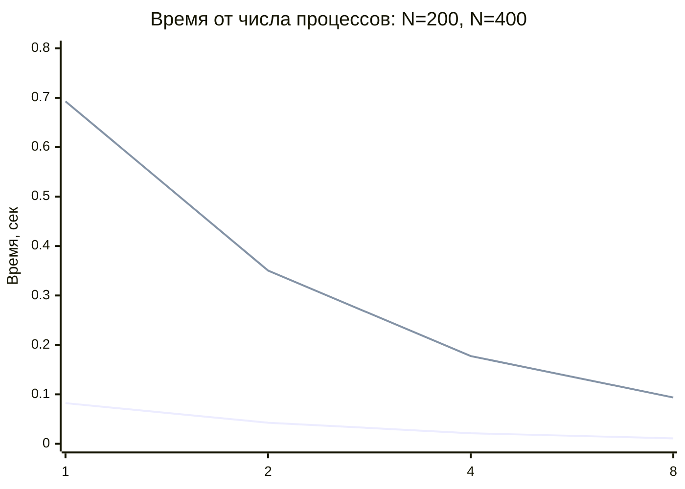
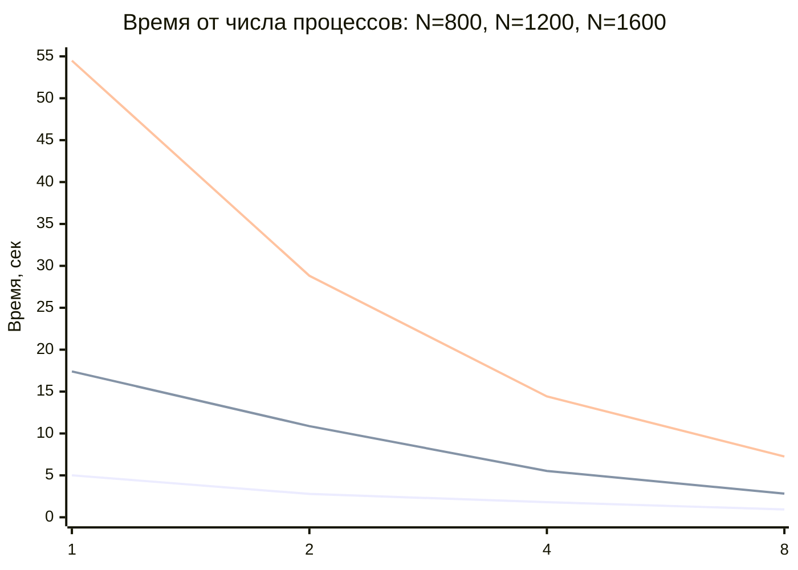
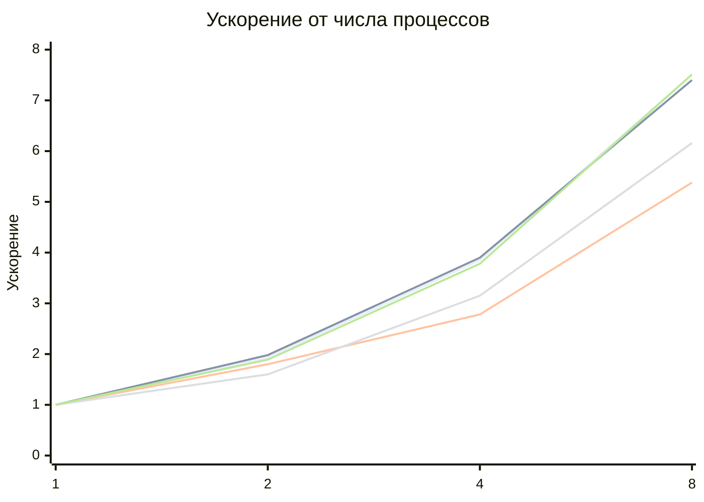
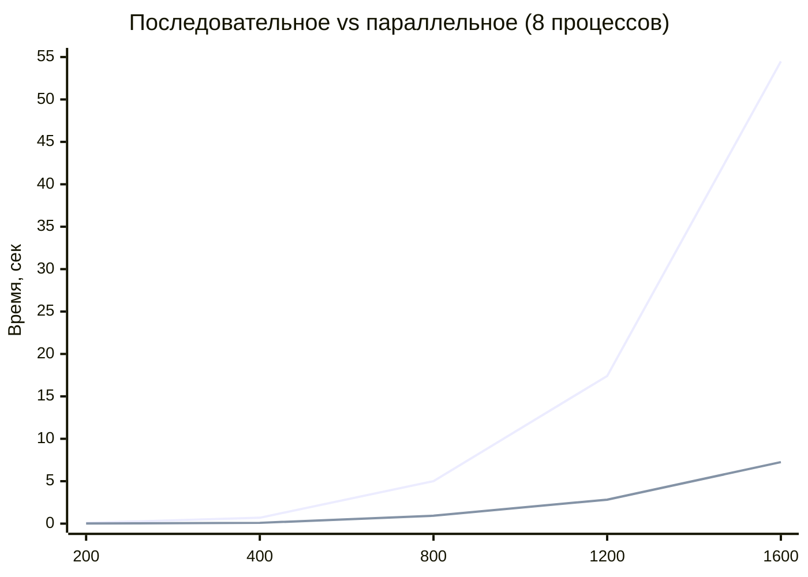
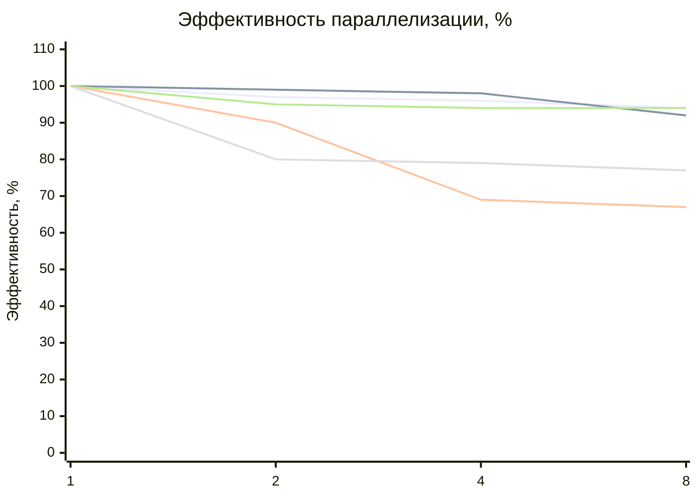

# Отчёт по лабораторной работе №5
## Параллельное умножение матриц с использованием MPI на суперкомпьютере

## Цель работы

Модифицировать программу умножения квадратных матриц для параллельного выполнения с использованием технологии **MPI** и провести серию экспериментов на **суперкомпьютере** при разных:

- размерах матриц: `200`, `400`, `800`, `1200`, `1600`
- количествах вычислительных процессов: `1`, `2`, `4`, `8`

В отличие от лабораторной работы №3, эксперименты проводились на **суперкомпьютере "Сергей Королёв"**, что позволяет оценить производительность параллельной программы в условиях профессиональной высокопроизводительной вычислительной системы.

---

## Экспериментальные данные

| Размер | Процессы | Операций (N³) | Время (сек) |
|-------:|---------:|--------------:|------------:|
| 200 | 1 | 8000000 | 0.0822348 |
| 200 | 2 | 8000000 | 0.0425924 |
| 200 | 4 | 8000000 | 0.0213436 |
| 200 | 8 | 8000000 | 0.0109520 |
| 400 | 1 | 64000000 | 0.6928440 |
| 400 | 2 | 64000000 | 0.3503730 |
| 400 | 4 | 64000000 | 0.1774860 |
| 400 | 8 | 64000000 | 0.0936665 |
| 800 | 1 | 512000000 | 5.0087800 |
| 800 | 2 | 512000000 | 2.7868800 |
| 800 | 4 | 512000000 | 1.8029200 |
| 800 | 8 | 512000000 | 0.9304190 |
| 1200 | 1 | 1728000000 | 17.4047000 |
| 1200 | 2 | 1728000000 | 10.8762000 |
| 1200 | 4 | 1728000000 | 5.5301200 |
| 1200 | 8 | 1728000000 | 2.8259900 |
| 1600 | 1 | 4096000000 | 54.4905000 |
| 1600 | 2 | 4096000000 | 28.8189000 |
| 1600 | 4 | 4096000000 | 14.4186000 |
| 1600 | 8 | 4096000000 | 7.2509100 |

---

## Вычисленные показатели ускорения и эффективности

Ускорение: **S(p) = T(1) / T(p)**

Эффективность: **E(p) = S(p) / p**

| Размер | Процессы | Время (сек) | Ускорение | Эффективность |
|-------:|---------:|------------:|----------:|--------------:|
| 200 | 1 | 0.0822348 | 1.00 | 100% |
| 200 | 2 | 0.0425924 | 1.93 | 97% |
| 200 | 4 | 0.0213436 | 3.85 | 96% |
| 200 | 8 | 0.0109520 | 7.51 | 94% |
| 400 | 1 | 0.6928440 | 1.00 | 100% |
| 400 | 2 | 0.3503730 | 1.98 | 99% |
| 400 | 4 | 0.1774860 | 3.90 | 98% |
| 400 | 8 | 0.0936665 | 7.40 | 92% |
| 800 | 1 | 5.0087800 | 1.00 | 100% |
| 800 | 2 | 2.7868800 | 1.80 | 90% |
| 800 | 4 | 1.8029200 | 2.78 | 69% |
| 800 | 8 | 0.9304190 | 5.38 | 67% |
| 1200 | 1 | 17.4047000 | 1.00 | 100% |
| 1200 | 2 | 10.8762000 | 1.60 | 80% |
| 1200 | 4 | 5.5301200 | 3.15 | 79% |
| 1200 | 8 | 2.8259900 | 6.16 | 77% |
| 1600 | 1 | 54.4905000 | 1.00 | 100% |
| 1600 | 2 | 28.8189000 | 1.89 | 95% |
| 1600 | 4 | 14.4186000 | 3.78 | 94% |
| 1600 | 8 | 7.2509100 | 7.51 | 94% |

---

## График 1. Зависимость времени выполнения от числа процессов

### Малые матрицы: N = 200 и N = 400

## Большие матрицы: N = 800, N = 1200, N = 1600

# Анализ графика
- При увеличении числа процессов время выполнения существенно уменьшается для всех размеров матриц.
- Для N = 1600 переход от 1 к 8 процессам сокращает время с 54.5 сек до 7.25 сек.
- Зависимость времени от числа процессов близка к линейной, что характерно для эффективной параллельной реализации.
- На суперкомпьютере наблюдается более стабильное масштабирование по сравнению с обычным ПК.

## График 2. Зависимость ускорения от числа процессов

## График 3. Зависимость времени от размера матрицы

# Анализ графика
- Время выполнения растёт пропорционально кубу размера матрицы O(N³).
- Параллельная версия на 8 процессах работает в 5.4–7.5 раз быстрее последовательной.
- С ростом размера матрицы абсолютный выигрыш от параллелизации значительно увеличивается.
- Для N = 1600 параллельная версия экономит около 47 секунд на одно вычисление.

## График 4. Эффективность параллелизации

# Анализ графика
- Эффективность параллелизации на суперкомпьютере очень высокая для большинства конфигураций.
- Для N = 200, N = 400 и N = 1600 эффективность остаётся выше 90% даже при 8 процессах.
- Снижение эффективности для N = 800 и N = 1200 может быть связано с особенностями распределения данных или загрузки узлов суперкомпьютера.
- В целом эффективность работы на суперкомпьютере значительно выше, чем на обычном ПК.

# Выводы по работе
В ходе лабораторной работы программа умножения матриц с использованием MPI была запущена на суперкомпьютере, и проведена серия экспериментов с разными размерами матриц и количествами процессов.

По итогам экспериментов можно сделать следующие выводы:
- Параллельная программа на MPI корректно работает на суперкомпьютере для всех заданных конфигураций.
- Ускорение на 8 процессах достигает 5.4–7.5 раз, что значительно выше, чем на обычном ПК.
- Эффективность параллелизации на суперкомпьютере достигает 94–99% для большинства конфигураций.
- Стабильное масштабирование с числом процессов позволяет уверенно прогнозировать производительность.
- Размер матрицы остаётся главным фактором роста времени выполнения.

## Работа показала, что технология MPI в сочетании с возможностями суперкомпьютера позволяет эффективно решать задачи параллельного умножения матриц с высокой эффективностью (до 94–99%) и значительным ускорением (до 7.5 раз) на 8 процессах.