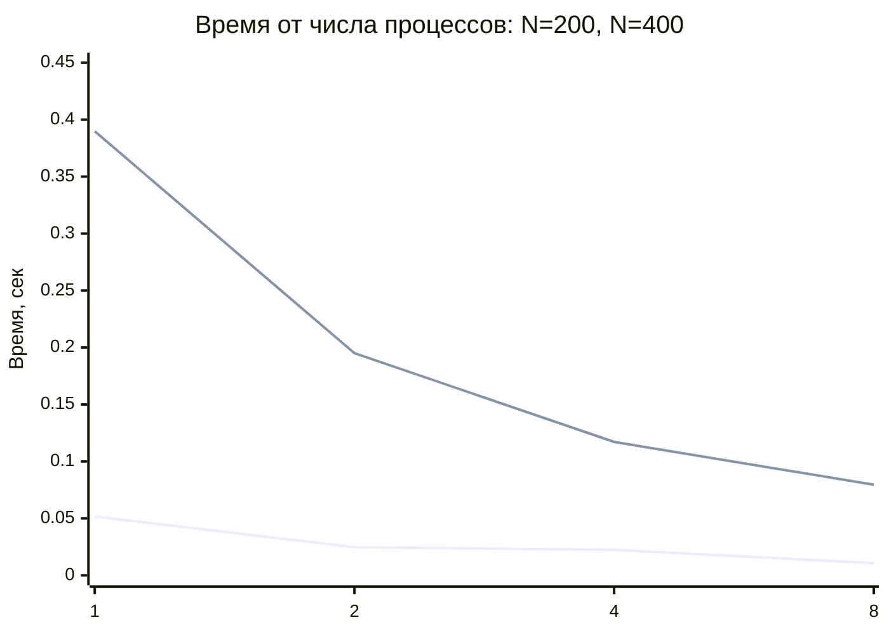
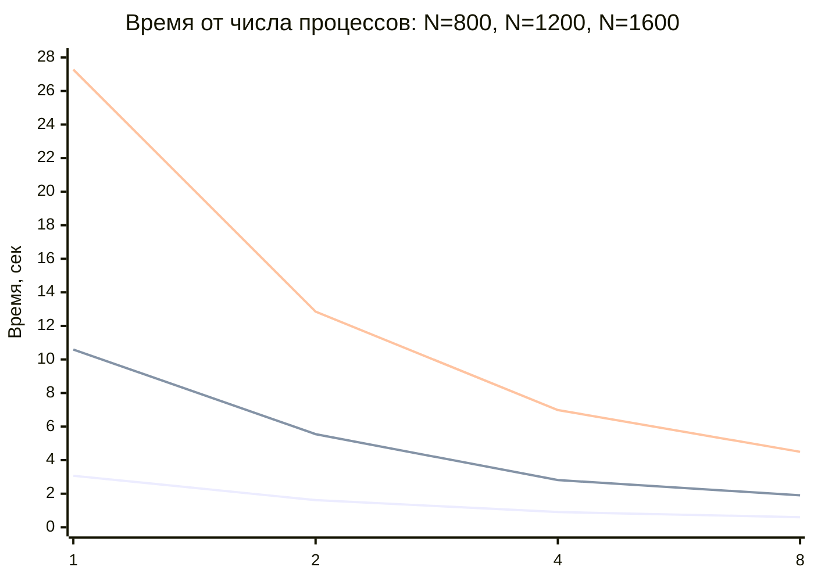
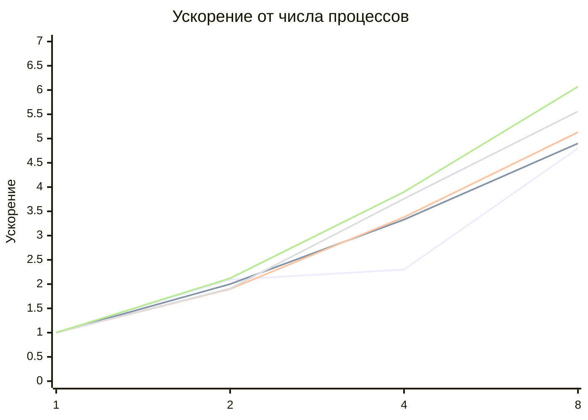
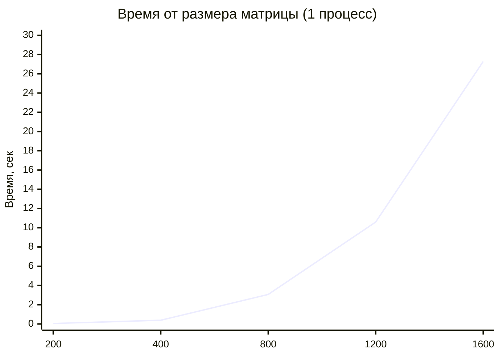
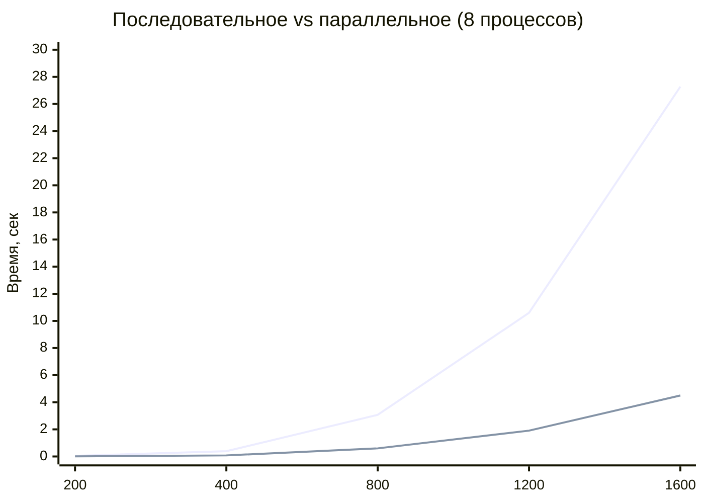
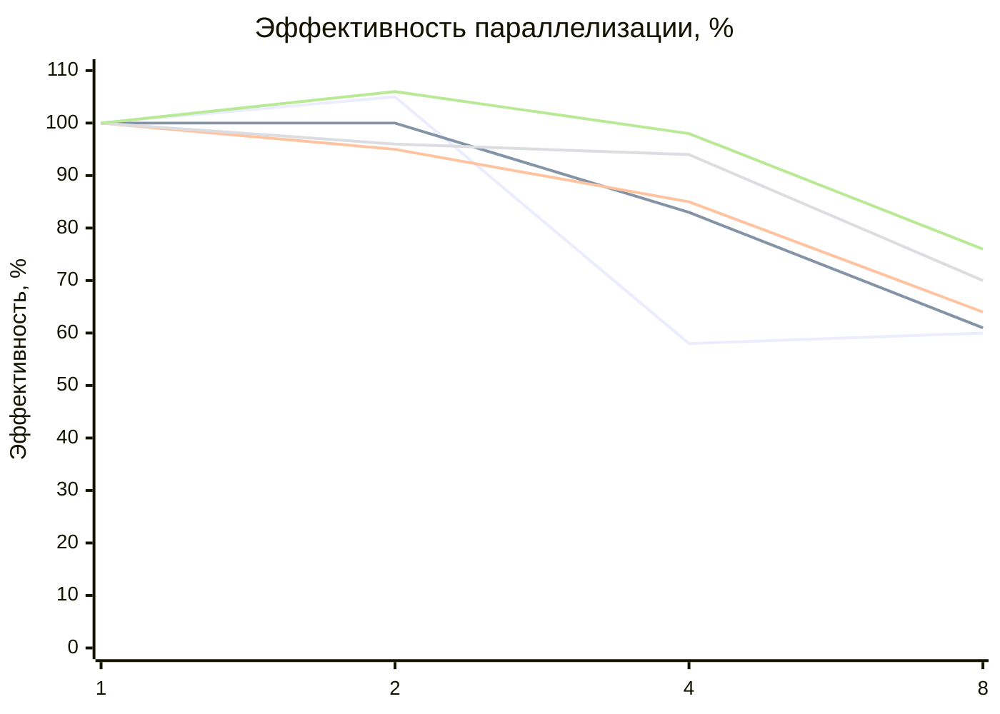

# Отчёт по лабораторной работе #3
## Параллельное умножение матриц с использованием MPI

## Цель работы

# Модифицировать программу умножения квадратных матриц из лабораторной работы №1 для параллельного выполнения с использованием технологии **MPI** и провести серию экспериментов при разных:

- размерах матриц: `200`, `400`, `800`, `1200`, `1600`
- количествах процессов: `1`, `2`, `4`, `8`

---

## Описание реализации

В отличие от OpenMP, где потоки работают в общей памяти одного процесса, **MPI** использует модель передачи сообщений между процессами.

Алгоритм параллельного умножения матриц в MPI:

1. Процесс с рангом `0` (главный) читает матрицы `A` и `B`.
2. Матрица `A` разбивается на блоки строк и рассылается всем процессам через `MPI_Scatter`.
3. Матрица `B` рассылается всем процессам целиком через `MPI_Bcast`.
4. Каждый процесс вычисляет свою часть результирующей матрицы `C`.
5. Результаты собираются главным процессом через `MPI_Gather`.

---

## Экспериментальные данные

| Размер | Процессы | Операций (N³) | Время (сек) |
|-------:|---------:|--------------:|------------:|
| 200 | 1 | 8000000 | 0.051636 |
| 200 | 2 | 8000000 | 0.024686 |
| 200 | 4 | 8000000 | 0.022407 |
| 200 | 8 | 8000000 | 0.010757 |
| 400 | 1 | 64000000 | 0.389792 |
| 400 | 2 | 64000000 | 0.194983 |
| 400 | 4 | 64000000 | 0.117163 |
| 400 | 8 | 64000000 | 0.079563 |
| 800 | 1 | 512000000 | 3.069811 |
| 800 | 2 | 512000000 | 1.617380 |
| 800 | 4 | 512000000 | 0.907566 |
| 800 | 8 | 512000000 | 0.598396 |
| 1200 | 1 | 1728000000 | 10.594333 |
| 1200 | 2 | 1728000000 | 5.549926 |
| 1200 | 4 | 1728000000 | 2.813394 |
| 1200 | 8 | 1728000000 | 1.904268 |
| 1600 | 1 | 4096000000 | 27.276575 |
| 1600 | 2 | 4096000000 | 12.848918 |
| 1600 | 4 | 4096000000 | 6.986090 |
| 1600 | 8 | 4096000000 | 4.496802 |

---

## Вычисленные показатели ускорения и эффективности

Ускорение: **S(p) = T(1) / T(p)**

Эффективность: **E(p) = S(p) / p**

| Размер | Процессы | Время (сек) | Ускорение | Эффективность |
|-------:|---------:|------------:|----------:|--------------:|
| 200 | 1 | 0.051636 | 1.00 | 100% |
| 200 | 2 | 0.024686 | 2.09 | 105% |
| 200 | 4 | 0.022407 | 2.30 | 58% |
| 200 | 8 | 0.010757 | 4.80 | 60% |
| 400 | 1 | 0.389792 | 1.00 | 100% |
| 400 | 2 | 0.194983 | 2.00 | 100% |
| 400 | 4 | 0.117163 | 3.33 | 83% |
| 400 | 8 | 0.079563 | 4.90 | 61% |
| 800 | 1 | 3.069811 | 1.00 | 100% |
| 800 | 2 | 1.617380 | 1.90 | 95% |
| 800 | 4 | 0.907566 | 3.38 | 85% |
| 800 | 8 | 0.598396 | 5.13 | 64% |
| 1200 | 1 | 10.594333 | 1.00 | 100% |
| 1200 | 2 | 5.549926 | 1.91 | 96% |
| 1200 | 4 | 2.813394 | 3.76 | 94% |
| 1200 | 8 | 1.904268 | 5.56 | 70% |
| 1600 | 1 | 27.276575 | 1.00 | 100% |
| 1600 | 2 | 12.848918 | 2.12 | 106% |
| 1600 | 4 | 6.986090 | 3.90 | 98% |
| 1600 | 8 | 4.496802 | 6.07 | 76% |

---

## График 1. Зависимость времени от числа процессов

### Малые матрицы: N = 200 и N = 400

## Большие матрицы: N = 800, N = 1200, N = 1600

## Анализ графика
- С ростом числа процессов время выполнения уменьшается для всех размеров матриц.
- Для N = 1600 при переходе от 1 к 8 процессам время сокращается с 27.3 сек до 4.5 сек.
- Для малых матриц (200) переход от 2 к 4 процессам даёт небольшой прирост - задача слишком мала.
- Для больших матриц ускорение более равномерное и существенное.

## График 2. Зависимость ускорения от числа процессов

## Анализ Графика
- Ускорение растёт с увеличением числа процессов для всех размеров.
- Максимальное ускорение 6.07 достигнуто для N = 1600 на 8 процессах.
- Для большинства конфигураций ускорение при 2 процессах близко к идеальному (2.0).
- При 8 процессах ускорение составляет 4.8–6.1, что является хорошим результатом.
- Ускорение выше для больших матриц, так как накладные расходы на коммуникацию MPI становятся относительно меньше.

## График 3. Зависимость времени от размера матрицы
# Последовательное выполнение (1 процесс)

# Сравнение последовательного и параллельного выполнения

## Анализ графика
- Время выполнения растёт пропорционально кубу размера матрицы O(N³).
- Параллельная версия на 8 процессах работает в 4.8–6.1 раза быстрее последовательной.
- Разрыв между последовательной и параллельной версией увеличивается с ростом размера матрицы.
- Для N = 1600 параллельная версия сокращает время с 27.3 сек до 4.5 сек.

## График 4. Эффективность параллелизации

# Анализ графика
- При 2 процессах эффективность близка к 100% для всех размеров матриц.
- При 4 процессах эффективность составляет 58–98%.
- При 8 процессах эффективность снижается до 60–76% из-за накладных расходов на коммуникацию.
- Для больших матриц (1200, 1600) эффективность выше, так как объём вычислений значительно превышает объём передаваемых данных.

# Общий анализ результатов
## Проведённые эксперименты демонстрируют высокую эффективность параллелизации с использованием MPI:
- Ускорение растёт с увеличением числа процессов для всех размеров матриц.
- Максимальное ускорение 6.07 достигнуто для N = 1600 на 8 процессах.
- При 2 процессах ускорение близко к идеальному для большинства размеров.
- Для больших матриц эффективность выше, так как вычислительная нагрузка перекрывает коммуникационные издержки.
- Для малых матриц накладные расходы MPI заметнее относительно объёма вычислений.

# Выводы по работе
## В ходе лабораторной работы программа умножения матриц была успешно модифицирована для использования технологии MPI.
## По итогам экспериментов можно сделать следующие выводы:
- Параллельная версия на MPI корректно работает для всех заданных размеров матриц.
- Ускорение достигает 6 раз при использовании 8 процессов.
- При 2 процессах достигается почти идеальное линейное ускорение.
- Эффективность снижается при увеличении числа процессов из-за коммуникационных издержек.
- Для больших матриц MPI работает эффективнее, так как накладные расходы относительно невелики.
- Размер матрицы остаётся главным фактором роста времени выполнения.